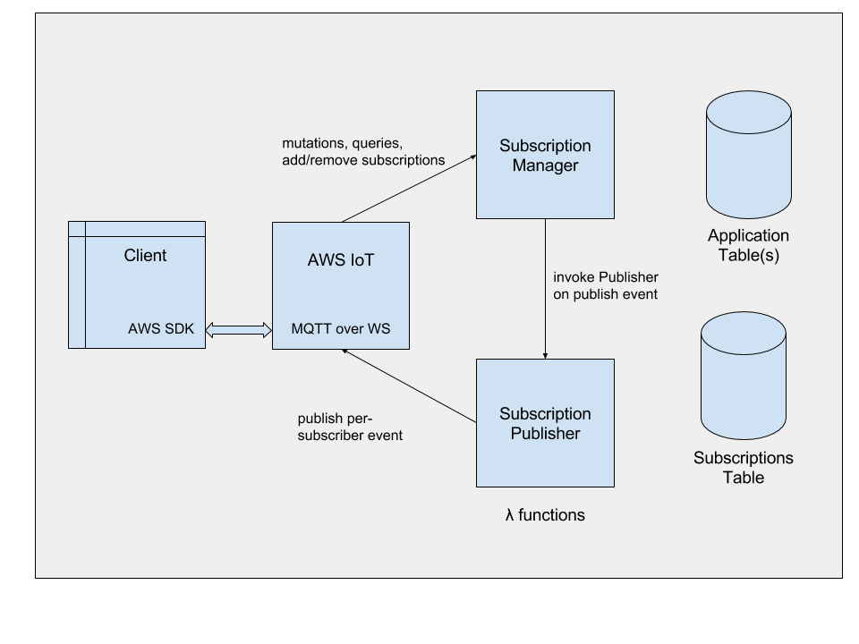

# graphql-aws-iot-server (serverless and lambda friendly!)

(Work in progress!)
An adaptation of the [Apollo Subscriptions Ws Transport](https://github.com/apollographql/subscriptions-transport-ws) to support serverless GraphQL queries, mutations and subscriptions using AWS iot websockets.

## Architecture Diagram



## Functions

### SubscriptionManager
 * The manager publishes all socket to ${AppPrefix}/in/clientId where clientId is the unique identifier per client connected on AWS IoT
 * For queries / mutations the manager immediately published the result upon processing the query.
 * For subscriptions the following process occurs:
  1. Validate subscription with GraphQLSchema
  2. Store subscriptions information in DB. 
  You provide the function to store a new subscription to the db. The addSubscription must return a promise on completion. The  input parameter to this function is of the following format:
  ``` ts
 interface Subscription {
    clientId: string;
    query: string;
    subscriptionName: string;
    subscriptionId: string;
    variableValues: { [key: string]: any };
}
```
3. The GraphQlServer Package exports a PubSub class which is used to publish a new message. The PubSub class has a publish method which invokes the SubscriptionPublisherFunction. In your GraphQL Schema you invoke the publish method in the same way as you would if you were using the servered subscriptions transport. The method returns a promise to ensure completion.
```js
return pubsub.publish('NEW_TODO', { teamTodoAdded: input }).then(_ => {...});
```

4. You are also required to provide a removeSubscriptionFunction that returns a promise on completion. The parameters to this function which are provided by this server package will be subscriptionName and clientId. We recommend having and index to retrieve a subscription based on those properties.

### SubscriptionPublisher

The publisher has one public method executeQueriesAndSendMessages which takes an array of subscriptions in the same format as they were stored and executes the queries and then publishes the result to the active subscribers. This method returns a promise to ensure completion. 

The triggerNameToSubscriptionNamesMap and the triggerNameToFilterFunctionsMap is defined in your own lambda function before invoking the publisher.

1. Your application Subscription Publisher will get triggerName and payload in the event object.
2. Use the triggerNameToSubscriptionNamesMap to identify all the subscriptionNames that you need to retrieve subscription rows for. 
3. Retrieve subscriptions from the db. Ideally for each subscription pass in the array of subscription rows to the executeQueriesAndSendMessages. 
4. Execute the filterFunction for the triggerName on each row.
5. For those rows that return true in the filter function, you can run the executeQueriesAndSendMessages with an array of subscriptions and payload as the parameters.
6. You can choose to run this function in batches as per your application logic. 

The database choice and how you choose to batch has been purposely left to the application rather than this helper package for reusability.

### Best Practices

* We recommend using the AWS IoT disconnect lifecycle event to remove active subscriptions from a clientId. 
See https://github.com/ioxe/graphql-aws-iot-example for an example of a pruner on the aws iot disconnect event as well as a full working demo.

* For scale you can publish aws iot events to a kinesis stream which then invokes your SubscriptionManager lambda function


